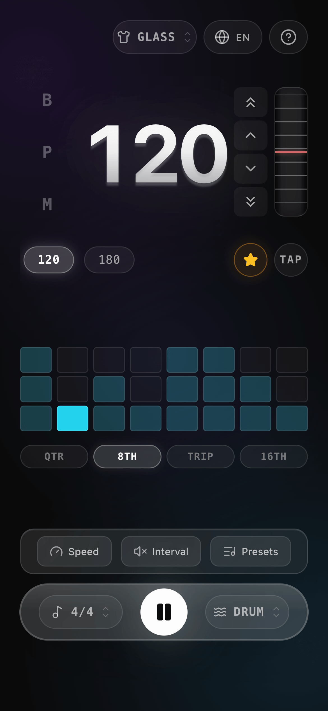
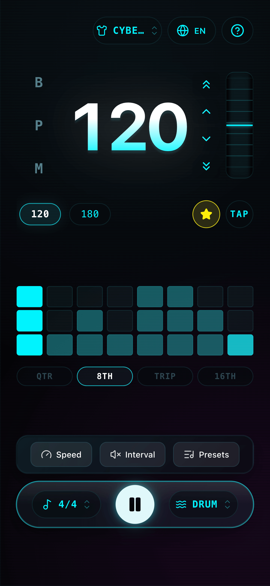
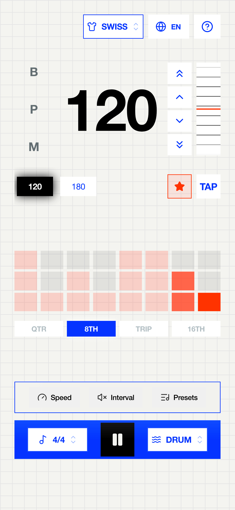
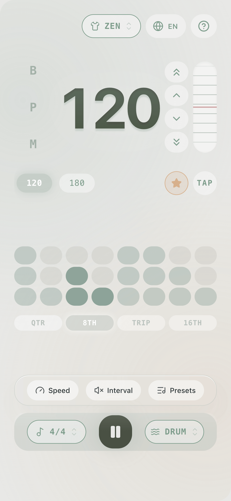
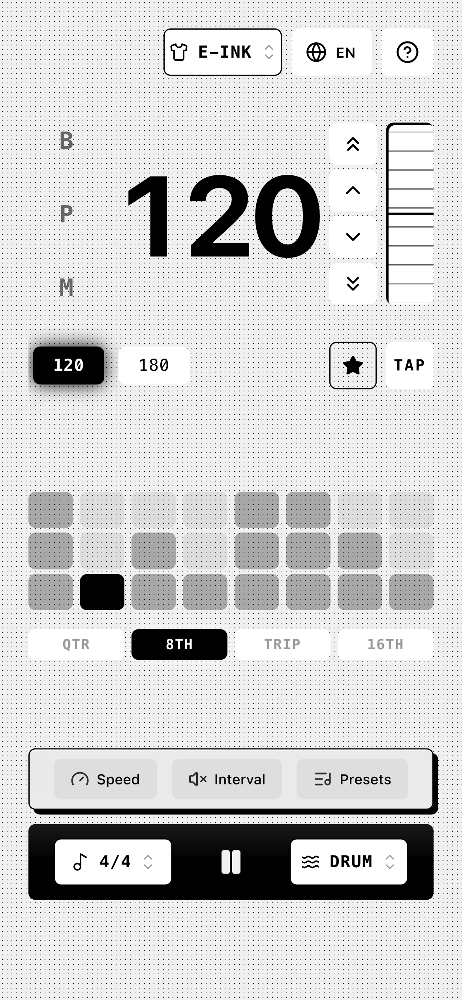
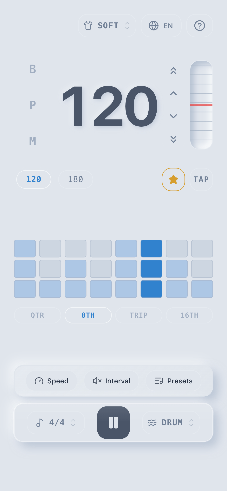
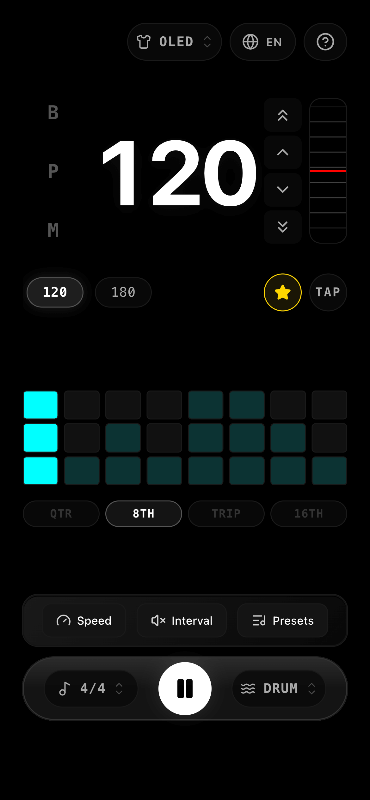
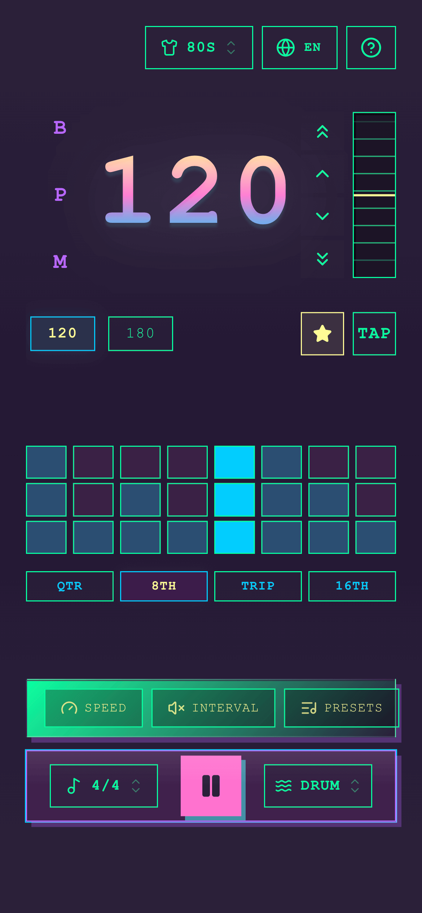

# Vibe Metronome | 随变节拍器

A professional online metronome with advanced training features, built with React and Web Audio API.

[Live Demo →](https://glooory.github.io/metronome/)

  

## 🎨 Themes

|                         Glass                         |                      Cyberpunk                      |                    Kids Pop                     |
| :---------------------------------------------------: | :-------------------------------------------------: | :---------------------------------------------: |
|        |  |   |
|                    **Swiss Style**                    |                    **Zen Mode**                     |                   **E-Paper**                   |
|        |        |   |
|                    **Neumorphism**                    |                     **Amoled**                      |                    **Retro**                    |
|  |     |  |

## ✨ Features

### Core Metronome

- **BPM Control** (30-300) - Drag slider or use keyboard arrows
- **Time Signatures** - 2/4, 3/4, 4/4, 5/4, 6/4
- **Subdivisions** - Quarter, Eighth, Triplet, Sixteenth notes
- **Sound Presets** - Sine, Woodblock, Drum Kit, Mechanical

### Beat Customization

- Click beat bars to cycle through states: Normal → Mute → Sub-accent → Accent
- Visual indicator shows beat strength (3 blocks = accent, 2 blocks = sub-accent, 1 = normal, 0 = muted)
- BPM memory bar for quick tempo switching

### 🚀 Training Tools

| Feature              | Description                                                       |
| -------------------- | ----------------------------------------------------------------- |
| **Speed Trainer**    | Auto-increment BPM every N measures with target limit             |
| **Interval Trainer** | Play X bars, mute Y bars - visualizer continues during mute       |
| **Presets**          | Save/load complete configurations (BPM, time sig, sound, pattern) |

### 🌐 Internationalization

- English / 中文 toggle

## 🛠️ Tech Stack

- **Frontend**: React 19 + TypeScript
- **Build Tool**: Vite
- **Styling**: CSS Modules (BEM naming)
- **Animation**: Framer Motion
- **Audio**: Web Audio API
- **Icons**: Lucide React
- **Deployment**: GitHub Pages

## 📦 Installation

```bash
# Clone the repository
git clone https://github.com/Glooory/metronome.git

# Navigate to directory
cd metronome

# Install dependencies
npm install

# Start development server
npm run dev

# Build for production
npm run build
```

## 🎹 Keyboard Shortcuts

| Key           | Action        |
| ------------- | ------------- |
| `Space`       | Play / Pause  |
| `↑` / `↓`     | Adjust BPM ±1 |
| `Shift + ↑/↓` | Adjust BPM ±5 |

## 📁 Project Structure

```
src/
├── components/
│   ├── BpmDisplay/          # BPM wheel control
│   ├── BpmHistoryBar/       # Saved BPM chips
│   ├── CustomGlassSelect/   # Dropdown selects
│   ├── HelpModal/           # User guide modal
│   ├── LiquidGlassDock/     # Bottom control dock
│   ├── PresetsModal/        # Preset management
│   ├── IntervalTrainerModal/  # Interval training config
│   ├── SpeedTrainerModal/   # Speed training config
│   ├── TrainerDock/         # Training tools toolbar
│   └── Visualizer/          # Beat visualization
├── hooks/
│   └── useMetronome.ts      # Audio scheduling logic
├── i18n.ts                  # Translations
├── constants.ts             # App constants & types
└── App.tsx                  # Main application
```

## 🔊 Sound Synthesis

All sounds are generated in real-time using Web Audio API:

- **Sine**: Pure sine wave oscillator
- **Woodblock**: FM synthesis with noise burst
- **Drum**: Layered kick (sub oscillator + body + click)
- **Mechanical**: Filtered noise + click transient

## 📄 License

MIT © [Glooory](https://github.com/Glooory)
