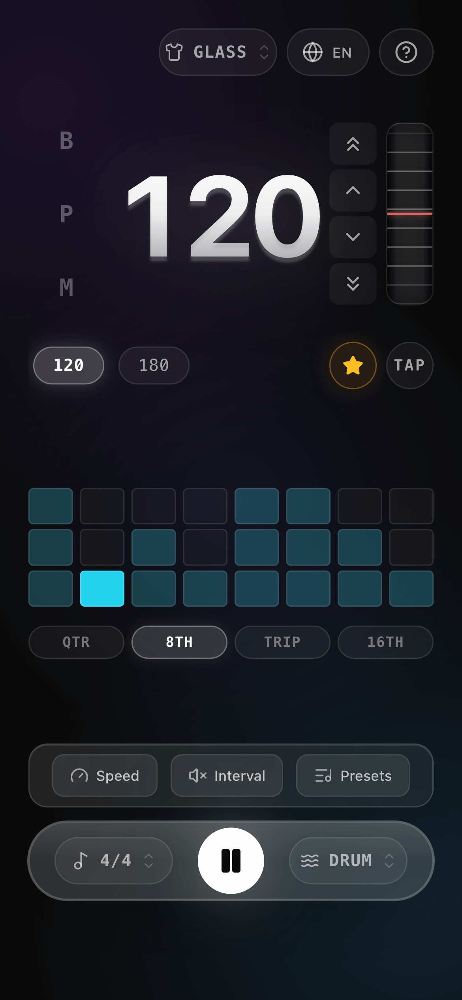
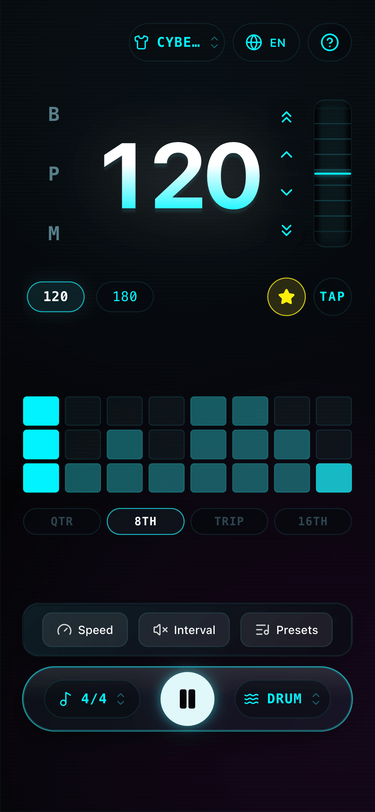
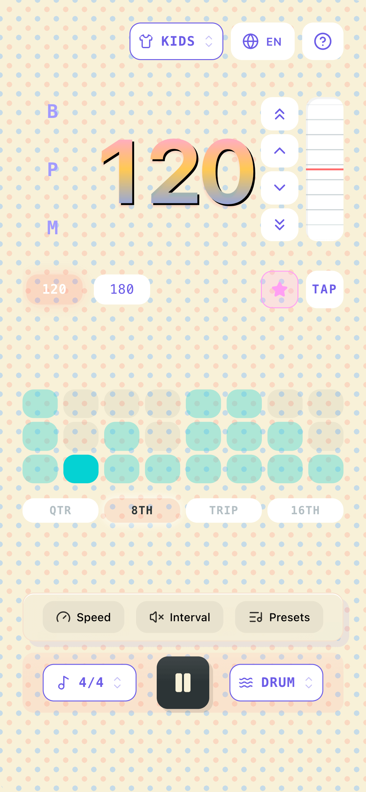
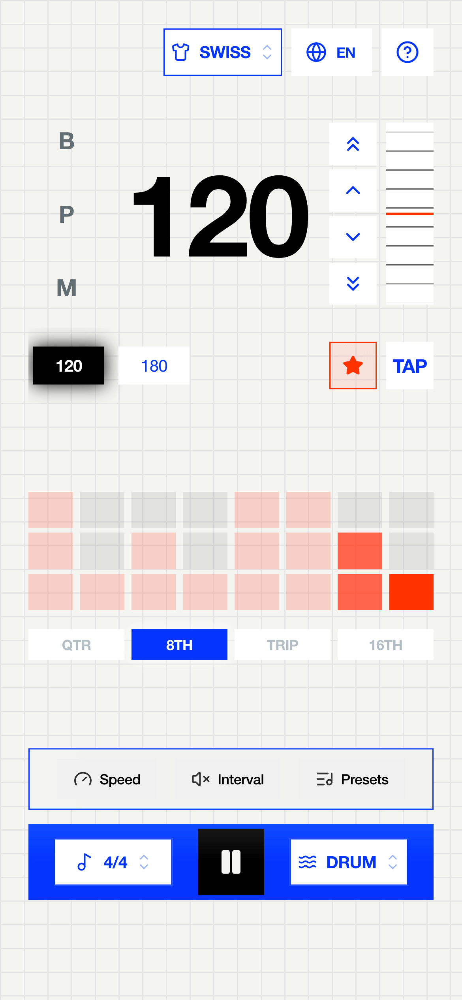
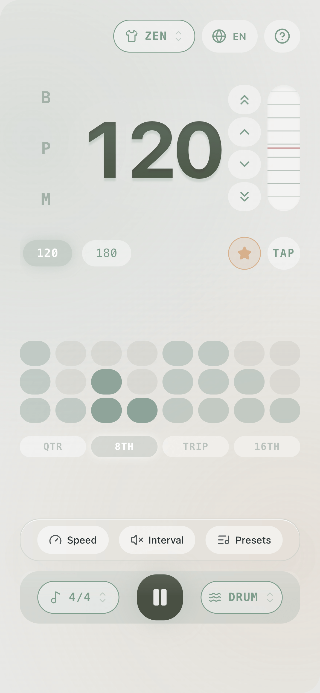
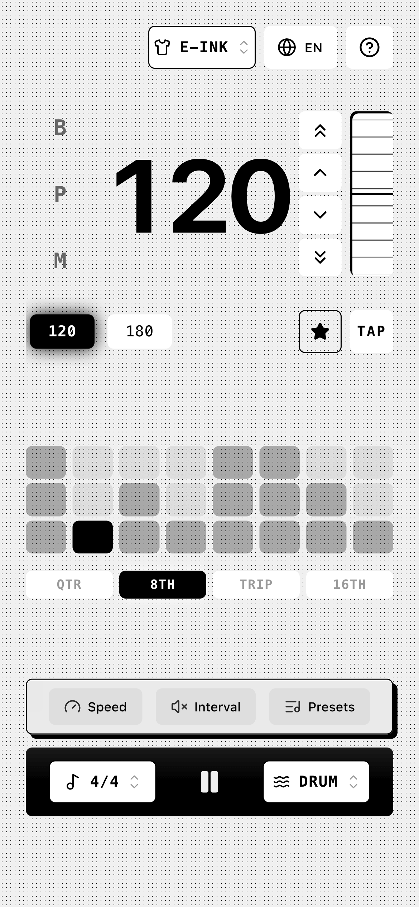
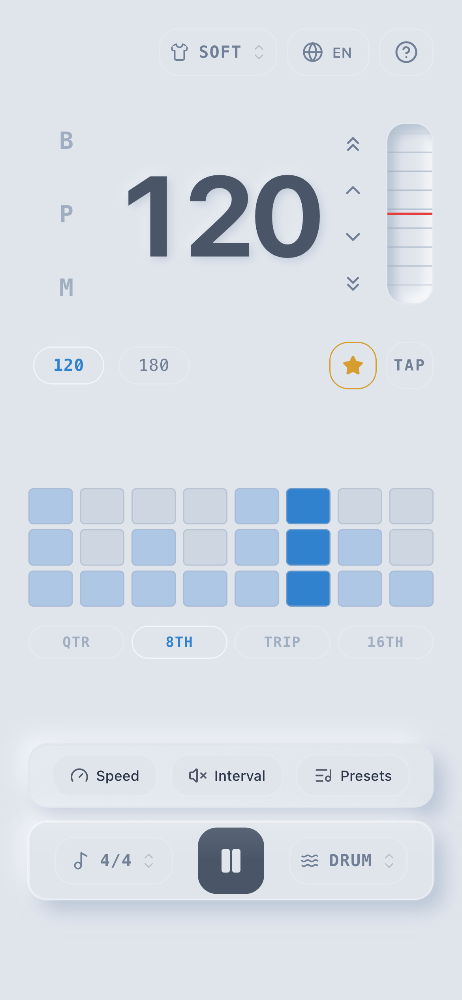
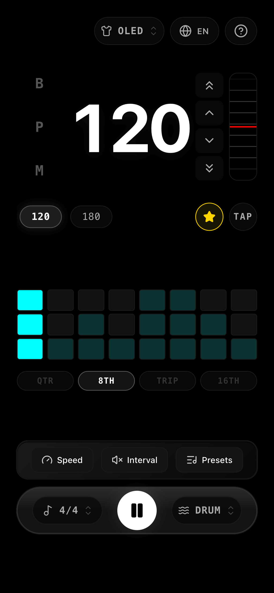
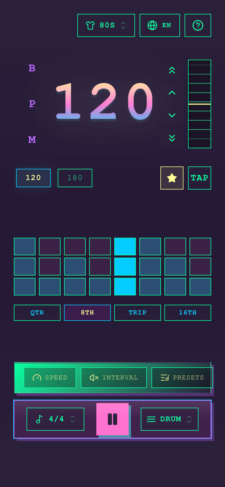

# Vibe Metronome | 随变节拍器

A professional online metronome with advanced training features, built with React and Web Audio API.

[Live Demo →](https://glooory.github.io/metronome/)

  

## 🎨 Themes

Screenshots below show a subset of the available built-in themes.

|                         Glass                         |                      Cyberpunk                      |                    Kids Pop                     |
| :---------------------------------------------------: | :-------------------------------------------------: | :---------------------------------------------: |
|        |  |   |
|                    **Swiss Style**                    |                    **Zen Mode**                     |                   **E-Paper**                   |
|        |        |   |
|                    **Neumorphism**                    |                     **Amoled**                      |                    **Retro**                    |
|  |     |  |

## ✨ Features

### Core Metronome

- **BPM Control** (`30-300`) - drag wheel, type directly, use keyboard arrows, or tap tempo
- **Flexible Time Signatures** - numerator `1-16`, denominator `2 / 4 / 8 / 16`, with quick presets for `2/4`, `3/4`, `4/4`, `6/8`, `12/8`
- **BPM Note Binding** - BPM can target `1/2`, `1/4`, `1/8`, `1/16`, dotted `1/2`, dotted `1/4`, or dotted `1/8`
- **Subdivisions** - `1`, `2`, `3`, or `4` steps per beat, normalized against the selected beat unit
- **Sound Presets** - Sine, Woodblock, Drum, Mechanical

### Beat Customization

- Click beat bars to cycle states: Normal → Sub-accent → Accent → Mute → Normal
- Visual feedback uses stacked blocks (`3 = accent`, `2 = sub-accent`, `1 = normal`, `0 = muted`)
- Shift controls move the pattern start by step and can be reset to center
- BPM memory bar stores up to 20 tempos for quick recall

### 🚀 Training Tools

| Feature              | Description                                                                 |
| -------------------- | --------------------------------------------------------------------------- |
| **Speed Trainer**    | Auto-increment BPM every N measures until a target BPM is reached           |
| **Interval Trainer** | Play X bars, mute Y bars, while the visualizer keeps running                |
| **Swing & Shift**    | Add groove/shuffle feel and offset the step pattern start                   |
| **Presets**          | Save/load BPM, meter, beat note, BPM note, subdivision, sound, pattern, swing, and shift |

### 🌈 Themes & Persistence

- **16 built-in themes** - `aurora`, `blueprint`, `brutalism`, `clay`, `cyberpunk`, `disco`, `e-ink`, `kids`, `mechanical`, `oled`, `sketch`, `soft`, `swiss`, `terminal`, `wood`, `zen`
- **Theme switching** - cycle from the header button or choose from the theme dropdown
- **Auto-save** - BPM, meter, trainers, presets, language, theme, and other settings persist in `localStorage`

### 🌐 Internationalization

- Built-in UI translations for English, 中文, 日本語, 한국어, Deutsch, Français, Español, Русский, Português
- Language is persisted locally and synced to the `?lang=` query parameter for shareable localized links

## 🛠️ Tech Stack

- **Frontend**: React 19 + TypeScript
- **Build Tool**: Vite
- **Styling**: CSS Modules + CSS Tokens + Theme Overrides
- **Animation**: Native CSS transitions
- **Audio**: Web Audio API
- **Icons**: Lucide React
- **Deployment**: GitHub Pages

## 📦 Installation

```bash
# Clone the repository
git clone https://github.com/Glooory/metronome.git

# Navigate to directory
cd metronome

# Install dependencies
npm install

# Start development server
npm run dev

# Build for production
npm run build
```

## 🎹 Keyboard Shortcuts

| Key           | Action        |
| ------------- | ------------- |
| `Space`       | Play / Pause  |
| `↑` / `↓`     | Adjust BPM ±1 |
| `Shift + ↑/↓` | Adjust BPM ±5 |

## 📁 Project Structure

```text
src/
├── components/
│   ├── BpmDisplay/            # BPM readout, drag wheel, note binding
│   ├── BpmHistoryBar/         # Saved BPM chips + tap tempo
│   ├── Button/                # Button primitive
│   ├── Checkbox/              # Toggle primitive
│   ├── ControlDock/           # Bottom playback dock
│   ├── HelpModal/             # In-app usage guide
│   ├── Input/                 # Text/number input primitive
│   ├── IntervalTrainerModal/  # Interval training config
│   ├── ModalShell/            # Shared modal container
│   ├── NoteIcon/              # Music note glyph rendering
│   ├── PresetsModal/          # Preset management
│   ├── Select/                # Dropdown select
│   ├── Slider/                # Range slider primitive
│   ├── SEO.tsx                # Meta tags + JSON-LD
│   ├── SpeedTrainerModal/     # Speed training config
│   ├── SwingSettingModal/     # Swing control
│   ├── TimeSignatureModal/    # Meter editor
│   ├── TrainerDock/           # Training tools toolbar
│   └── Visualizer/            # Beat pattern editor + shift controls
├── hooks/
│   └── useMetronome.ts        # Web Audio scheduling and synthesis
├── helpers/
│   └── index.ts               # Meter/subdivision helpers
├── styles/
│   ├── tokens/                # Core + semantic + component tokens
│   └── themes/                # Theme override files
├── constants.ts               # App constants & persisted config types
├── i18n.ts                    # UI translations
├── theme-registry.ts          # Theme registration
└── App.tsx                    # Main application composition
```

## 🔊 Sound Synthesis

All sounds are generated in real-time using Web Audio API:

- **Sine**: Square oscillator through low-pass filtering
- **Woodblock**: FM-style struck tone with transient body
- **Drum**: Layered kick (`sub oscillator + body + click`)
- **Mechanical**: Dry filtered noise click without reverb

## 📄 License

MIT © [Glooory](https://github.com/Glooory)
